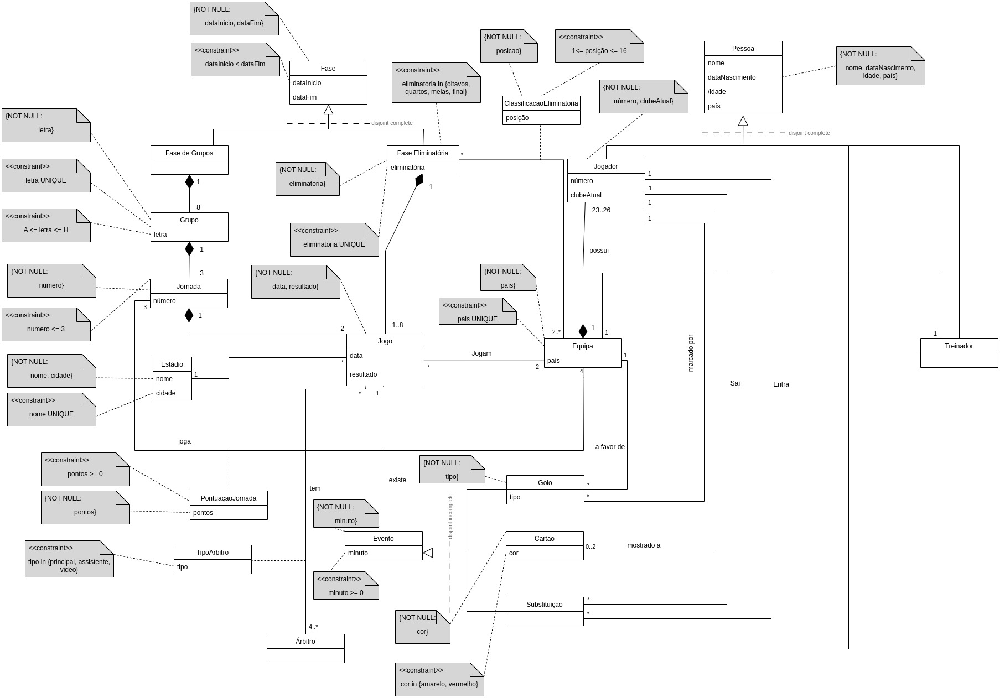

# Mundial-Qatar-BD
Este repositório contém o projeto da Unidade Curricular "Bases de Dados" @ FEUP. O objetivo era construir uma base de dados para o FIFA World Cup Qatar 2022, capaz de guardar informação sobre os diferentes jogos bem como as pontuações das equipas nas diferentes fases da competição.

